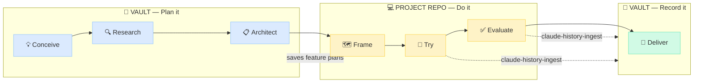

# claude-dev-wiki

> **Seed idea:** [Andrej Karpathy's "vibe-coding" gist](https://gist.github.com/karpathy/442a6bf555914893e9891c11519de94f) — the original prompt for keeping an LLM-maintained wiki alongside your code.

A personal dev knowledge base for builders, maintained by an LLM (Claude Code, Cursor, etc.) and read by you. You drop sources into `raw/`, the LLM distills them into `wiki/`, and over time the wiki becomes a queryable second brain that informs every future task.

The contract for how the LLM operates lives in [`CLAUDE.md`](./CLAUDE.md) — loaded automatically on every Claude Code session opened in this directory.

## Philosophy

Two surfaces, one knowledge graph:

- **`raw/`** is **user-curated source material** — articles you clipped, projects you're working on, ideas you're exploring. You write here. The LLM reads.
- **`wiki/`** is **LLM-maintained distillation** — patterns, decisions, technologies, sources, projects, ideas. The LLM writes here. You read.

The flow is one-way: stuff comes in through `raw/`, gets distilled into `wiki/`, and stays there as connected, citation-backed knowledge. Future questions get answered by reading the wiki — not by re-googling.

## The workflow — CRAFTED

Every project moves through seven phases from spark to ship. Some happen in this vault (planning + records), others happen in your actual code repo (the work). The vault stores the **plan** and the **distilled result**; the project repo is where the code lives.



### Phase mapping

| | Phase | Where | Artifact | What helps |
|---|---|---|---|---|
| **C** | **Conceive** | Vault | `raw/projects/<slug>/00-idea.md` | Manual capture — `.scripts/new-project.sh <slug>` scaffolds the folder. |
| **R** | **Research** | Vault | `raw/projects/<slug>/01-research.md` | [`wiki-research`](.claude/skills/wiki-research/) — multi-round web search, landscape + honest verdict. |
| **A** | **Architect** | Vault | `raw/projects/<slug>/02-prd.md` | Manual — what + why. The [`to-prd`](https://github.com/mattpocock/skills) skill from [Matt Pocock's skills](https://github.com/mattpocock/skills) can draft a PRD from your current conversation context. Stress-test it with [`grill-me`](https://github.com/mattpocock/skills) before committing. |
| **F** | **Frame** | **Project repo** | `raw/projects/<slug>/features/*.md` (saved back to vault) + `03-plan.md` for the high-level | **Claude Code Plan Mode** (built-in, Shift+Tab) and **[`brainstorming`](https://github.com/obra/superpowers)** + **[`writing-plans`](https://github.com/obra/superpowers)** from the [superpowers](https://github.com/obra/superpowers) plugin. Stress-test the resulting plan with **[`grill-me`](https://github.com/mattpocock/skills)** from [Matt Pocock's skills](https://github.com/mattpocock/skills). Detailed feature/section plans get written in the project repo; the resulting feature files are saved into the vault so other skills (`wiki-promote-feature`, `claude-history-ingest`) can find them. |
| **T** | **Try** | **Project repo** | code, commits, PRs | [`claude-history-ingest`](.claude/skills/claude-history-ingest/) passively tracks what you worked on, advances feature statuses, flags blockers. |
| **E** | **Evaluate** | **Project repo** | tests, debugging notes | Same — captured via the same Claude Code sessions. |
| **D** | **Deliver** | Vault | `wiki/projects/<slug>/features/<name>.md` + auto-created decision pages | [`wiki-promote-feature`](.claude/skills/wiki-promote-feature/) — lifts the working feature doc into the schema-compliant wiki page. |

The key split: **detailed work (Frame, Try, Evaluate) happens in your actual code repo**, not in the vault. The vault stores the early thinking (Conceive, Research, Architect), receives the feature plans during Frame, gets passive updates during Try and Evaluate (via `claude-history-ingest`), and captures the distilled result on Deliver.

After Deliver, the wiki becomes the lasting reference — citation-backed knowledge that future projects can consult via [`wiki-query`](.claude/skills/wiki-query/).

## Companion tools (outside the template)

The vault ships with 10 skills (listed below). But the Frame phase is best done with external tools that aren't shipped here:

- **[Claude Code Plan Mode](https://docs.claude.com/en/docs/claude-code/overview)** — built into Claude Code. Press **Shift+Tab** in a session to switch into plan mode; Claude proposes a step-by-step plan you approve before any code is written. Best for "I know roughly what to do, let me lock in the steps before I touch files."
- **[`brainstorming`](https://github.com/obra/superpowers/tree/main/skills/brainstorming)** *(superpowers plugin)* — explores requirements and design before implementation. Use when the shape of the solution isn't clear yet.
- **[`writing-plans`](https://github.com/obra/superpowers/tree/main/skills/writing-plans)** *(superpowers plugin)* — turns a spec into a multi-step implementation plan. Use after brainstorming when you have requirements but no concrete plan.
- **[`to-prd`](https://github.com/mattpocock/skills)** *(from [Matt Pocock's skills](https://github.com/mattpocock/skills))* — turns the current conversation context into a PRD draft. Best in the **Architect** phase when you've been thinking out loud and want a structured PRD without writing it from scratch.
- **[`grill-me`](https://github.com/mattpocock/skills)** *(from [Matt Pocock's skills](https://github.com/mattpocock/skills))* — interviews you relentlessly about a plan or design until every branch of the decision tree is resolved. Useful in the **Architect** and **Frame** phases for stress-testing a PRD or feature plan before you commit.

Install superpowers and Matt Pocock's skills via the standard Claude Code plugin marketplace or directly from their GitHub repos. None of these are required to use this vault — they're the planning-side tools that pair naturally with the vault's record-side skills.

## What's in here

```
.
├── CLAUDE.md            ← workflow contract for the LLM (loaded automatically)
├── wiki/                ← LLM-maintained knowledge base (you read, LLM writes)
│   ├── index.md         ← content catalog — LLM reads this first on every op
│   ├── topics.md        ← controlled vocabulary for topic frontmatter
│   ├── hot.md           ← short-lived "what's live right now" cache
│   ├── log.md           ← append-only event log
│   ├── templates/       ← one template per entity type
│   ├── projects/        ← project pages + per-project features/ and decisions/
│   ├── patterns/        ← reusable cross-project patterns
│   ├── technologies/    ← libraries, frameworks, tools you use
│   ├── ideas/           ← processed idea pages
│   ├── sources/         ← one summary per ingested article/tweet/repo
│   └── journal/         ← daily notes (DD-MM-YYYY.md)
├── raw/                 ← user-curated sources (you write, LLM reads)
│   ├── articles/        ← web clippings
│   ├── tweets/          ← tweets & threads
│   ├── repos/           ← GitHub repo notes
│   ├── ideas/           ← raw idea dumps
│   └── projects/        ← project lifecycle docs (one folder per project)
│       ├── _template/   ← skeleton copied by .scripts/new-project.sh
│       └── <slug>/
│           ├── STATUS.md          ← quick-glance status; updated frequently
│           ├── 00-idea.md         ← Conceive: initial spark
│           ├── 01-research.md     ← Research: landscape + verdict
│           ├── 02-prd.md          ← Architect: what + why
│           ├── 03-plan.md         ← Frame: high-level how
│           ├── kanban.md          ← task board
│           ├── features/          ← one .md per feature
│           ├── roadmaps/          ← versioned roadmaps (v1.md, v2.md, …)
│           ├── notes/             ← dated meeting/ad-hoc notes
│           └── archive/           ← superseded docs worth keeping
├── .scripts/            ← automation: new-project.sh, list-claude-history.py, etc.
├── .claude/skills/      ← 10 project-scoped skills the LLM can invoke
├── .manifest.json       ← ingest ledger (sources processed, hashes, timestamps)
└── .vault-meta.json     ← personalization config written by init-vault (one-time)
```

## Skills — when to use each

The vault ships with 10 skills under `.claude/skills/`. Claude Code auto-discovers them. Trigger each by saying anything close to its listed phrases — you rarely have to call them by name.

### Lifecycle skills (per CRAFTED phase)

| Skill | Trigger phrases | What it does |
|---|---|---|
| [`init-vault`](.claude/skills/init-vault/) | "set up my wiki", "initialize", "personalize" | **One-time** after cloning. Asks ~10 questions (date format, folder picks, topic seed, optional CLAUDE.md tweaks). Writes `.vault-meta.json`. Run once. |
| [`wiki-research`](.claude/skills/wiki-research/) | "research `<idea>`", "is X worth building", "what's out there for Y", "deep dive on Z" | **Research phase.** Multi-round web search → `01-research.md` for a project, or `## Idea Research` section in `wiki/ideas/<slug>.md` for standalone ideas. Honest verdict required. |
| [`claude-history-ingest`](.claude/skills/claude-history-ingest/) | "ingest my Claude history", "sync my work", "what have I been working on" | **Try / Evaluate phases.** Mines `~/.claude/projects/*` and desktop agent sessions. Two outputs: journal entries + **automatic project tracking** — advances feature statuses (`planned → in-progress → shipped`), flags blockers, surfaces decisions. |
| [`wiki-promote-feature`](.claude/skills/wiki-promote-feature/) | "promote feature X", "file the auth feature", "X is shipped — add to wiki" | **Deliver phase.** Lifts a finished feature plan from `raw/projects/<slug>/features/<name>.md` into the schema-compliant `wiki/projects/<slug>/features/<name>.md`. Surfaces decision and pattern candidates. |

### Knowledge skills (anytime)

| Skill | Trigger phrases | What it does |
|---|---|---|
| [`wiki-ingest`](.claude/skills/wiki-ingest/) | "ingest `<path>`", "process this", "add to wiki" | Distill any source (article, tweet, repo, paper, screenshot, PDF) into `wiki/sources/`. Propagates through every relevant project/pattern/technology page. |
| [`wiki-query`](.claude/skills/wiki-query/) | Any question; "consult the brain", "what do I know about X" | Answer with citations. Cheap-first pipeline (index → section grep → full read). Index-only fast mode available. |
| [`weekly-digest`](.claude/skills/weekly-digest/) | "weekly digest", "what did I do this week", "stand-up" | Read-only synthesis across journals, projects, ingests. Writes to `wiki/digests/<range>.md` + inline output for Slack/email copy-paste. |

### Maintenance skills (periodic)

| Skill | Trigger phrases | What it does |
|---|---|---|
| [`wiki-status`](.claude/skills/wiki-status/) | "what's the status", "delta", "wiki dashboard", "wiki insights" | Two modes: **delta** (what's pending to ingest, recommend append vs rebuild) and **insights** (graph analysis — hubs, bridges, fragmented topic clusters). |
| [`wiki-lint`](.claude/skills/wiki-lint/) | "lint the wiki", "audit", "what needs fixing" | 12-check health audit: orphans, broken links, missing frontmatter, stale projects, topic vocabulary issues, date format consistency, journal filename pattern. |
| [`cross-linker`](.claude/skills/cross-linker/) | "link my pages", "cross-reference", "find missing links" | Write-heavy companion to `wiki-lint` — actually inserts the missing `[[wikilinks]]`. Pair with lint: lint finds the problems, cross-linker fixes them. |

## Getting started

### Option 1 — Clone as-is (fastest)

```sh
git clone <this-repo> my-wiki
cd my-wiki
claude
```

The wiki is empty and ready. Drop your first source into `raw/articles/` and ask Claude to `ingest <path>`.

### Option 2 — Personalize first

After cloning, ask Claude:

> "Set up this wiki for me."

This invokes the `init-vault` skill — walks through personalization (date format, folder picks, topic seed) and writes `.vault-meta.json`.

## Setting up daily journal ingest (optional)

`daily-ingest.sh` is a scheduled script that automatically creates yesterday's journal page and populates it with a summary of your Claude Code sessions. Without it, you run `claude-history-ingest` manually whenever you want a sync.

The script ships as a **stub** — you need to implement steps 2–4 (reading `.jsonl` files, summarizing, writing back to the journal). The comments inside explain the approach. Once implemented:

**macOS — one command:**

```sh
.scripts/install-launchd.sh
```

Installs a launchd plist that runs `daily-ingest.sh` at 9:30am every day. Logs go to `.scripts/daily-ingest.log`.

To uninstall:
```sh
launchctl bootout gui/$(id -u) ~/Library/LaunchAgents/com.user.dev-wiki.daily-ingest.plist && \
  rm ~/Library/LaunchAgents/com.user.dev-wiki.daily-ingest.plist
```

**Linux — add a crontab entry:**

```sh
crontab -e
# add:
30 9 * * * /absolute/path/to/.scripts/daily-ingest.sh >> /absolute/path/to/.scripts/daily-ingest.log 2>&1
```

If you don't want to implement the script, the `claude-history-ingest` skill does the same thing interactively — ask Claude "ingest my Claude history" any time.

## Starting a new project — the CRAFTED walkthrough

```sh
.scripts/new-project.sh my-new-project
```

Creates `raw/projects/my-new-project/` from the template with stamped dates. Then walk the phases:

1. **C — Conceive**: fill `00-idea.md`.
2. **R — Research**: ask Claude to `research my-new-project` → produces `01-research.md` (or appends to a `wiki/ideas/` page if the idea is standalone).
3. **A — Architect**: write `02-prd.md` manually (what + why) — or use [`to-prd`](https://github.com/mattpocock/skills) to draft it from a brainstorming conversation, then stress-test with [`grill-me`](https://github.com/mattpocock/skills).
4. **F — Frame**: in your code repo, use Claude Code Plan Mode (Shift+Tab) or `brainstorming` + `writing-plans` from superpowers. Stress-test with [`grill-me`](https://github.com/mattpocock/skills). Save the resulting feature plans back into `raw/projects/my-new-project/features/<feature>.md`.
5. **T — Try**: build in your code repo. `claude-history-ingest` tracks progress.
6. **E — Evaluate**: test in your code repo. Same tracker.
7. **D — Deliver**: when a feature ships, ask Claude to `promote-feature <name>` → produces `wiki/projects/my-new-project/features/<name>.md` plus any decision/pattern pages worth keeping.

In between, periodically:

- `ingest <path>` to add sources you've clipped.
- `lint the wiki` + `cross-linker` to keep the graph healthy.
- `weekly-digest` for a Friday recap.

## Adding to it

This template is the starting point, not the destination. Expect to:

- Tune `CLAUDE.md` to your taste (add an operation, change schemas, add directories).
- Build out `wiki/topics.md` over the first few weeks — that's how SURFACE matches conversation to pages.
- Add or revise skills in `.claude/skills/` as you find workflows you want to automate.
- Customize `.scripts/` for your environment (especially if you want `daily-ingest.sh` to actually run on a schedule).

The wiki becomes more valuable the more you feed it. The first month is mostly investment; after that it pays you back on every task.
