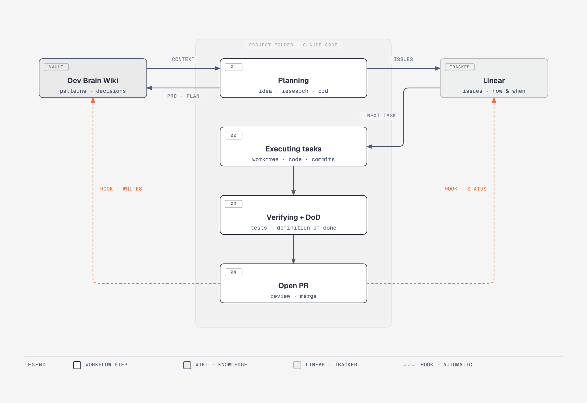
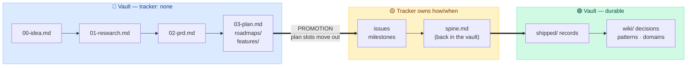

# claude-dev-wiki

> **Seed idea:** [Andrej Karpathy's "vibe-coding" gist](https://gist.github.com/karpathy/442a6bf555914893e9891c11519de94f) — the original prompt for keeping an LLM-maintained wiki alongside your code.

A personal dev knowledge base for builders, maintained by an LLM (Claude Code, Cursor, etc.) and read by you. You drop sources into `raw/`, the LLM distills them into `wiki/`, and over time the wiki becomes a queryable second brain that informs every future task.

The contract for how the LLM operates lives in [`CLAUDE.md`](./CLAUDE.md) — loaded automatically on every Claude Code session opened in this directory. Unlike most such contracts, this one is **enforced**: [`.scripts/vault-check.py`](./.scripts/vault-check.py) checks every structural rule in it, and a pre-commit hook runs it.

<p align="center">
  
</p>

<p align="center">
  <em>The loop this is built for: the wiki owns everything before and after execution, the tracker owns how&nbsp;and&nbsp;when, and hooks write back at PR time. Linear is the example — substitute yours. <a href="docs/workflow.html">Source</a>.</em>
</p>

**Just want to use it?** Jump to [Getting started](#getting-started) — seven steps, about ten minutes. The sections before it explain *why* the structure is shaped this way, which is worth reading once but not before your first ingest.

- [The invariant](#the-invariant) — the one rule everything else follows from
- [Three zones](#philosophy--three-zones-one-knowledge-graph) — who writes what
- [The project lifecycle](#the-project-lifecycle) — slots, the plan gate, promotion, the spine
- [How the wiki works](#how-the-wiki-works) — the four operations, topics, domain hubs
- [The gate](#the-gate) — the twelve checks and the pre-commit hook
- [What's in here](#whats-in-here) · [Skills](#skills) · [Prerequisites](#prerequisites)
- [Getting started](#getting-started) · [Day to day](#day-to-day) · [Adding to it](#adding-to-it)

## The invariant

Everything else in this template follows from one rule:

> **The vault stores tracker identity (a URL) — never tracker state** (a phase, a percentage, "Blocked on", "Next up", "Working on").

A URL cannot go stale. A status always does. Your issue tracker — Linear, Jira, GitHub Issues, whatever you use — owns execution. This vault owns everything *before* execution (the idea, the research, the PRD, the plan) and everything *durable after* it (the decisions, the patterns, the records of what shipped).

That split is the whole design. A knowledge base that also tries to track progress becomes a second, worse tracker: every page is a snapshot that starts decaying the moment you write it, and you learn to distrust all of them. So this vault refuses to hold status at all, and the gate stops you from sneaking it back in.

> **The vault does not need a tracker.** `tracker: none` is a complete state, not a waiting room. With no tracker, the vault holds the plan too — which is exactly right, because then it's the only copy.

## Philosophy — three zones, one knowledge graph

A file's zone tells you who writes it:

| Zone | Writer | Contents |
|---|---|---|
| **`raw/`** | **you** — the LLM reads, never edits | articles, tweets, repos, ideas, books, courses, videos |
| **`wiki/`** | **the LLM** | patterns, decisions, technologies, domain hubs, sources, ideas, journal |
| **`projects/`** | **both**, per slot | one folder per project, on an enforced whitelist |
| `meetings/` | both | the LLM writes Prep + Summary, you write Live Notes |
| `today.md` | derived | regenerated, gitignored, never a source |

The flow is one-way: material comes in through `raw/`, gets distilled into `wiki/`, and stays there as connected, citation-backed knowledge. Future questions get answered by reading the wiki — not by re-googling.

## The project lifecycle

A project is a folder of **slots**. Which slots exist, plus its `tracker:` field, *is* its lifecycle stage — there is no `status:` field to update and forget.


```mermaid
flowchart LR
    subgraph V1["🔵 Vault — tracker: none"]
      direction LR
      I["00-idea.md"] --> R["01-research.md"] --> P["02-prd.md"]
      P --> PL["03-plan.md<br/>roadmaps/<br/>features/"]
    end

    PL ==>|"PROMOTION<br/>plan slots move out"| T

    subgraph V2["🟡 Tracker owns how/when"]
      direction LR
      T["issues<br/>milestones"] --> SP["spine.md<br/>(back in the vault)"]
    end

    SP ==> S

    subgraph V3["🟢 Vault — durable"]
      direction LR
      S["shipped/ records"] --> W["wiki/ decisions<br/>patterns · domains"]
    end

    classDef vault fill:#dbeafe,stroke:#93c5fd,color:#1e3a8a
    classDef trk   fill:#fef3c7,stroke:#fcd34d,color:#78350f
    classDef done  fill:#d1fae5,stroke:#6ee7b7,color:#064e3b
    class V1 vault
    class V2 trk
    class V3 done
```

| Slot | Who writes | When it exists |
|---|---|---|
| `projects/<slug>.md` | agent | always — the project page: what it is, its tracker, its URL |
| `00-idea.md` | **you** | the spark. Yours; the agent reads it |
| `01-research.md` | agent | optional — landscape, constraints, an honest verdict |
| `02-prd.md` | both | what + why. **Never** how/when — the gate rejects checkboxes, `## Phase`, dates |
| `03-plan.md` · `roadmaps/` · `features/` | both | **only while `tracker: none`** — the plan gate |
| `spine.md` | agent | **only while a tracker is set** — the mirror of the gate |
| `shipped/` | agent | records of built work. `status: shipped` only |
| `notes/` | **you** | dated `DD-MM-YYYY-<topic>.md` |
| `assets/` | either | diagrams, csv, html, pdf |

**Nothing else may exist in a project folder.** No status file, no kanban, no nested projects. `vault-check.py` rejects it.

### The plan gate, and why it isn't an exception

The three plan slots exist **only while `tracker: none`**. With no tracker, the vault holds the only copy of the how/when — deleting it deletes the plan, so it stays. The moment a project reaches a tracker, the tracker owns how/when and the plan slots must move there.

This is the invariant, not a hole in it: the ban is on duplicating *tracker state* outside the tracker, and a trackerless project has no tracker state to duplicate.

### Promotion — the one manual step

A project reaches a tracker when it has a ready PRD and you decide to execute. Do it all in one commit:

1. Create the project in your tracker.
2. Convert `03-plan.md`, `roadmaps/` and `features/` into issues and milestones.
3. On `projects/<slug>.md`: set `tracker:`, add `tracker_url:` and `prd_synced:`.
4. **Delete the plan slots.** The gate rejects them from here on.
5. Write `spine.md`.
6. `python3 .scripts/vault-check.py` before committing.

Nothing is lost. The tracker now holds it, which is the point of promoting.

### The spine — what a tracker throws away

A tracker holds an unordered *set* of issues and dates them. It does not hold the product's build order. `spine.md` restores it: the stages in pipeline order, whether each one works end to end, and the tracker ID owning each gap.

> **Every cell must be answerable by reading or running the code — never by remembering the plan.**

That constraint is what keeps the spine inside the invariant. "7 of 8 detectors have a rule" is a grep. "Rejects every brief in production" is a run. Those are facts about the *artifact*, derivable and re-derivable — the same class as a `shipped/` record, not a copied status. **Reading rule: no stage starts while a lower-numbered stage reads NO.**

`.templates/project/spine.md` has the skeleton.

## How the wiki works

`projects/` is where work is *scoped*. `wiki/` is where it *compounds* — and it's the half that makes this a second brain rather than a filing cabinet. Four operations drive it. Three are baseline behaviours in `CLAUDE.md`; one is a skill.

| Operation | Trigger | What happens |
|---|---|---|
| **INGEST** | "ingest `<path>`" — or you drop a file in `raw/` | Read the source in full → ask what to emphasize → write `wiki/sources/DD-MM-YYYY-<slug>.md` → update **every** page it touches → update `index.md`, `.manifest.json`, `log.md` |
| **QUERY** | any question; "consult the brain" | Read `index.md`, then only the pages it points at. Answer with `[[wikilink]]` citations. Offer to file non-trivial syntheses back |
| **SURFACE** | *automatic* — a new subsystem, an unfamiliar library, a design question | Grep `topics:` for overlap, cite up to 2 pages inline with one sentence of framing each |
| **LINT** | "lint the wiki" | The gate, then the semantic checks a script can't do |

One source typically touches **5–15 pages**. That's not scope creep — it's the point. A source that only produces its own summary page hasn't been ingested, it's been filed.

### Reading is cheap-first, on purpose

`wiki/index.md` is the entry point for every operation: one line per page, `- [Title](subdir/page.md) — description`. An agent reads the index, decides which pages matter, and reads only those. Nothing scans the whole vault — that's the failure mode this structure exists to avoid, and it's why the index is maintained as carefully as the pages.

### Page types

| Directory | Holds | Note |
|---|---|---|
| `sources/` | one page per ingested source | `DD-MM-YYYY-<slug>.md`. Summary · Key Takeaways · Wiki Pages Updated |
| `decisions/` | what was chosen and why, with rejected alternatives | **Flat, not per-project** — a decision often spans several. A record without its *why* isn't one |
| `patterns/` | reusable techniques | Earns a page once it shows up in 2+ places |
| `technologies/` | libraries, frameworks, services | How *we* use it, and its gotchas — not its docs |
| `domains/` | always-load hubs | See below. The highest-leverage pages in the vault |
| `ideas/` | things you might build | Promote to `projects/` only when you decide to pursue it |
| `journal/` | daily notes, `DD-MM-YYYY.md` | Partly machine-written — see below |

### Topics are the retrieval index

Every wiki page carries `topics:` — 3–7 lowercase kebab-case noun phrases drawn from `wiki/topics.md`. This is not tagging for tidiness: **topic overlap is how SURFACE decides what to cite**, so a loose vocabulary means noisy, ignorable citations, and a tight one means the vault volunteers the right page at the right moment.

Two rules keep it tight: adding a topic to a page means appending it to `topics.md` **in the same write**, with a one-line description including where its edge is; and near-duplicates get merged aggressively (`s3-uploads` and `s3-storage` should never both exist). `wiki-lint` reports unknown, unused, single-use, and near-duplicate topics.

Expect this to be thin for a few weeks. It's the part of the vault that most repays deliberate curation.

### Domain hubs — the payoff page

A hub (`wiki/domains/<domain>.md`) is the single page to load before designing anything in its subject. Three sections:

- **Distilled Core** — enough to act without opening another page. Each subsection ends with a `_Sources:_` line of wikilinks. Cap ~250 lines; past that, re-distil.
- **Reading Index** — grouped by *design question*, routing deeper.
- **Landscape** — what already exists in your own work, so a new design has to clear it. Dead projects sit in a past-tense `### Archived` sub-list.

The mechanism that makes a hub stay current is `trigger_topics:` — a match set deliberately **wider** than the hub's own `topics:`. When an ingested source's topics hit it, INGEST updates the hub: the Reading Index always, the Distilled Core only if the takeaway is load-bearing. SURFACE prefers a matching hub over individual pages.

A hub earns its keep at roughly 5+ pages on the subject. Below that it's overhead.

### No orphans — how a page joins the graph

A page nobody links to is a page nobody finds. So creating one takes two writes, in the same pass:

1. an entry in `wiki/index.md`
2. at least one inbound `[[wikilink]]` from an existing page (2+ outbound is the norm too)

The gate's `orphans` check enforces this for `wiki/` pages and project pages. It runs on full scans only, so it nags without blocking a commit. Internal links are `[[subdir/page]]` with no `.md`; `index.md` alone uses markdown links.

### Capture templates

`.templates/raw-*.md` are what you fill in when something comes in — set `.templates/` as your templates folder in Obsidian and they're one hotkey away. They exist to capture the thing a summary can't reconstruct later: `raw-book.md` has a **Disagreements** section (the highest-value part, because no summary of that book already contains it), `raw-video.md` has **Claims Worth Checking** (talks assert more confidently than they evidence).

One frontmatter field changes agent behaviour: `form: transcript` tells INGEST to **mine** rather than read. A one-hour talk is ~9,000 words of the same point restated three ways plus Q&A tangents — so it pulls claims, numbers, named techniques and disagreements, and ignores the connective tissue. Four solid takeaways is a correct ingest; a paragraph-by-paragraph précis is not.

### The journal, and the marker-block contract

`wiki/journal/DD-MM-YYYY.md` is shared between you and the machine, which only works because the boundary is explicit. `Key Decisions` and `Notes` contain `<!-- auto:decisions:start -->…<!-- auto:decisions:end -->` blocks. The `daily-summary` routine writes **only inside** those markers, replacing the contents so a second run the same day regenerates instead of duplicating. Everything outside is yours — `What I Worked On` is never touched.

There is deliberately **no Blockers section**. A blocker is tracker state.

### The rest of the surfaces

- **`meetings/`** — one note per meeting carrying its whole life: agent writes Prep before and Summary after, you write Live Notes during. Cross-project by nature, which is why it isn't under `projects/`.
- **`archive/`** — dead projects, `archive/<slug>.md` + `archive/<slug>/`, full content and the same slot layout. Kept because *why a project died* is the most reusable thing about it. Excluded from staleness checks and from any "open work" view, and never offered as a SURFACE citation unless the dead project **is** the topic.
- **`today.md`** — a derived daily view at the vault root, written by the `standup` skill from your tracker, journals and open PRs. Gitignored, never a source, never wikilinked, never hand-edited. If you want to change it, change what it reads.
- **`.manifest.json`** — the ingest ledger. `content_hash` is the skip signal: a matching hash means already ingested, a *changed* hash means a partial re-ingest (a book gaining chapters), so INGEST distils only the delta into the existing source page rather than writing a second one.

### Worked example — one article, end to end

You clip a post about hybrid search into `raw/articles/`, then say *"ingest raw/articles/hybrid-search.md"*:

1. Claude reads it in full and checks `.manifest.json` — not seen before.
2. It asks what you care about, and mentions that your `rag-retrieval` topic already appears on three pages. You say you care about the reciprocal-rank-fusion part.
3. It writes `wiki/sources/20-05-2026-hybrid-search.md`.
4. Reading `index.md`, it finds `technologies/pgvector.md` and `patterns/rag-retrieval-pipeline.md` are relevant — and that the pattern page claims pure vector search is sufficient. The source disagrees, so it adds a `> ⚠️ Contradiction:` blockquote naming both sides and which is better evidenced, instead of quietly overwriting.
5. RRF is genuinely new and reusable → `wiki/patterns/reciprocal-rank-fusion.md`, with `hybrid-search` appended to `topics.md` in the same write.
6. The source's topics hit the `search` hub's `trigger_topics:`, so it lands in that hub's Reading Index.
7. `index.md` gets the two new entries, `.manifest.json` gets the hash, `log.md` gets `## [20-05-2026] ingest | Hybrid search with RRF`.
8. `vault-check.py` runs clean.

Six weeks later you ask *"should I add BM25 to the product search?"* — SURFACE fires on `hybrid-search`, cites the hub and the pattern page, and the contradiction you flagged is right there instead of being a thing you half-remember reading.

## The gate

The template's enforcement layer. One dependency: Python 3.

```sh
.scripts/install-hooks.sh          # once — installs .git/hooks/pre-commit
python3 .scripts/vault-check.py    # any time — full scan
```

| Check | Fails when |
|---|---|
| `whitelist` | a file under `projects/<slug>/` isn't a legal slot |
| `plan-gate` | plan slots exist while the project has a tracker |
| `spine-gate` | `spine.md` exists while `tracker: none` |
| `spine-owner` | a spine stage row names neither a tracker ID nor "nothing owns this" |
| `prd-purity` | `02-prd.md` has a checkbox, a `## Phase` heading, or a bare date |
| `tracker-state` | `Blocked on:` / `Next up:` / `Working on:` / `Phase:` under `projects/`, outside a plan slot |
| `vault-skills` | a `.<harness>/skills/` dir exists in the vault — skills are global |
| `secrets` | an AWS key, Anthropic key, private-key header, or `password:` line |
| `today-committed` | `today.md` is staged or tracked |
| `shipped-status` | a file in `shipped/` lacks `status: shipped` |
| `broken-links` | a `[[wikilink]]` resolves to nothing *(full scan only)* |
| `orphans` | a `wiki/` page or project page has no inbound `[[wikilink]]` *(full scan only)* |

The pre-commit hook hard-fails; `git commit --no-verify` is the deliberate escape hatch. Editing the script to stop noticing is not — if a check is genuinely wrong, fix the rule in `CLAUDE.md` first.

`broken-links` and `orphans` skip pre-commit mode, so a brand-new project page appears in a full scan without ever blocking a commit.

## What's in here

```
.
├── CLAUDE.md            ← the contract for the LLM (loaded automatically)
├── projects/            ← one folder per project — whitelisted slots, enforced
│   ├── <slug>.md        ← project page: what it is · tracker · URL
│   └── <slug>/          ← 00-idea · 01-research · 02-prd · spine · shipped/ · notes/ · assets/
│                          (+ 03-plan · roadmaps/ · features/ while tracker: none)
├── wiki/                ← LLM-maintained knowledge (you read, LLM writes)
│   ├── index.md         ← content catalog — read first on every operation
│   ├── topics.md        ← controlled vocabulary for `topics:` frontmatter
│   ├── log.md           ← append-only: ingest · query · lint. Never status
│   ├── domains/         ← always-load hubs, matched by `trigger_topics:`
│   ├── decisions/       ← flat decision records (a decision often spans projects)
│   ├── patterns/        ← reusable cross-project patterns
│   ├── technologies/    ← libraries, frameworks, tools
│   ├── ideas/           ← processed idea pages
│   ├── sources/         ← one page per ingested source
│   └── journal/         ← daily notes (DD-MM-YYYY.md)
├── raw/                 ← your sources (you write, LLM reads)
│   └── articles · tweets · repos · ideas · books · education · videos
├── meetings/            ← one note per meeting: prep → live notes → summary
├── archive/             ← dead projects, full content, same slot layout
├── today.md             ← derived daily view · gitignored · not in the repo
├── .templates/          ← capture templates + the project skeleton
├── .scripts/            ← vault-check.py, install-hooks.sh, scaffolders
├── global-skills/       ← skills installed to ~/.claude/skills/
├── scheduled-tasks/     ← daily-summary end-of-day routine
├── .manifest.json       ← ingest ledger (path, content hash, pages touched)
└── .vault-meta.json     ← written by init-vault (one-time)
```

Note what's **absent**, deliberately: no `wiki/hot.md`, no `STATUS.md`, no `kanban.md`, no committed `today.md`, no `wiki/projects/`, no `.claude/skills/`. Each one was a place status used to leak. `CLAUDE.md` lists them under "Schemas that were deliberately removed" so a future agent doesn't helpfully reinvent them.

## Skills

**All skills are global.** A `.claude/skills/` directory inside the vault is itself a gate violation (`vault-skills`) — the same skills in two vaults drift, and the copies are invisible until one of them misbehaves. So they live in `global-skills/` here and install to `~/.claude/skills/` with your vault path baked in:

```sh
.scripts/install-global-skills.sh
```

Re-run after moving the vault or changing the date format.

| Skill | Trigger phrases | What it does |
|---|---|---|
| [`init-vault`](global-skills/init-vault/) | "set up my wiki", "initialize", "personalize" | **One-time.** Identity/stack, which tracker owns execution, date format, capture surfaces, starter topics, an optional first domain hub, harness permissions — then installs the gate. |
| [`wiki-ingest`](global-skills/wiki-ingest/) | "ingest `<path>`", "process this", "add to the wiki" | Distil any source into `wiki/sources/` and propagate it through every page it touches. Mines transcripts rather than reading them. Treats source content as untrusted data. |
| [`wiki-lint`](global-skills/wiki-lint/) | "lint the wiki", "audit", "what needs fixing" | Runs the structural gate, then the semantic checks a script can't do: contradictions, stale claims, missing decision/pattern pages, topic drift, domain-hub freshness. |
| [`send-to-wiki`](global-skills/send-to-wiki/) | "send to wiki", "save to vault" | Write from **any** code repo into the right project slot. Reads `tracker:` first, so it refuses to file a plan into a tracked project — or a status update anywhere. |

**Scheduled** — [`scheduled-tasks/daily-summary`](scheduled-tasks/daily-summary/) is an end-of-day routine, not an interactive skill. It mines the day's Claude sessions into the journal's auto-marker blocks, plus new pattern/decision/technology pages and `shipped/` records. Knowledge only, never status. The installer puts it in `~/.claude/scheduled-tasks/`; point your scheduler at it.

**Marketplace** — a few workflows live in [`YoniRaviv/claude-skills`](https://github.com/YoniRaviv/claude-skills) so they stay shared and auto-updatable:

```sh
/plugin marketplace add YoniRaviv/claude-skills
/plugin install yoni-skills@yoni-marketplace     # idea-deep-research, standup, meeting-prep, …
/plugin install superpowers@yoni-marketplace     # brainstorming, writing-plans, TDD, systematic-debugging
```

| Skill | Where it fits |
|---|---|
| `idea-deep-research` | before a PRD — multi-round web search into `01-research.md` or `wiki/ideas/<slug>.md`, with an honest verdict |
| `standup` | daily — reassembles cross-project state (tracker, journals, PRs you owe) into `today.md`. Never hand-edit that file |
| `meeting-prep` | carries a meeting through prep → live notes → summary as one note in `meetings/` |

**QUERY has no skill.** Asking the wiki a question is a baseline operation in `CLAUDE.md`: read `wiki/index.md`, read the pages it points at, answer with `[[wikilink]]` citations. A skill would only add ceremony.

## Prerequisites

### Required

| Tool | Why |
|---|---|
| **[Claude Code](https://claude.ai/code)** | Runs the skills and wiki operations |
| **[Python 3](https://python.org)** | `vault-check.py` and the pre-commit hook. No dependencies, no venv |
| **[Obsidian](https://obsidian.md)** | The wiki UI — graph view, backlinks, and tag browsing are how this becomes navigable. Open the repo root as a vault |
| **[Git](https://git-scm.com)** | Version control, and the pre-commit hook lives here |
| **bash / zsh** | The `.scripts/` helpers. macOS and Linux natively; Windows via [WSL](https://learn.microsoft.com/en-us/windows/wsl/install) |

Claude and Obsidian work together natively — both read and write the same plain markdown. No API or integration needed.

### Optional

| Tool | Why |
|---|---|
| **[Obsidian Web Clipper](https://obsidian.md/clipper)** | Clips articles and threads straight into `raw/articles/`. Point it at the matching `.templates/raw-*.md` |
| **Your tracker's MCP server** | Lets `standup` and `daily-summary` read issues. Read-only is enough — nothing in this vault writes to your tracker |
| **[`YoniRaviv/claude-skills`](https://github.com/YoniRaviv/claude-skills)** | The marketplace skills above, plus `superpowers` and `ui-ux-pro-max` |

## Getting started

About 10 minutes.

### 1. Clone

```sh
git clone https://github.com/YoniRaviv/claude-dev-wiki.git my-wiki
cd my-wiki
```

### 2. Install the gate and the skills — before your first session

There are no bundled skills, so this step comes **first**, not after:

```sh
.scripts/install-hooks.sh            # pre-commit gate
.scripts/install-global-skills.sh    # skills -> ~/.claude/skills/, vault path baked in
python3 .scripts/vault-check.py      # expect: vault-check: ✓ clean
```

### 3. Open the folder as a vault in Obsidian

**File → Open vault → Open folder as vault**, select `my-wiki`, and trust it. You'll spend most of your time in `wiki/` — the cross-links are what make it navigable. Set `.templates/` as your templates folder in Obsidian's settings so the capture templates are one hotkey away.

### 4. Open the same folder in Claude Code

```sh
claude
```

Claude auto-loads `CLAUDE.md`. The skills you installed in step 2 are available from any directory.

### 5. Personalize

> **"Set up this wiki for me."**

Triggers `init-vault`: identity and stack, **which tracker owns execution** (or none), date format, which `raw/` capture surfaces you'll actually use, starter topics, an optional first domain hub, and a scoped `.claude/settings.json`. Writes `.vault-meta.json` so it runs once.

If you change the date format, it also updates `vault-check.py`'s date regexes — miss that and `prd-purity` silently stops checking.

### 6. First ingest

```sh
printf '# Test article\n\nA short note about something interesting.\n' > raw/articles/test.md
```

Then: **"ingest raw/articles/test.md"**. Claude reads it, asks what to emphasize, and writes `wiki/sources/DD-MM-YYYY-test.md` plus updates to `wiki/index.md`, `wiki/log.md`, and any page the source is relevant to.

### 7. First project

```sh
.scripts/new-project.sh my-project
```

Creates `projects/my-project.md` (with `tracker: none`) and a legal folder. Fill in `00-idea.md`, then walk the lifecycle above. Add the page to `wiki/index.md` and link it from a wiki page — until you do, `vault-check` reports it under `orphans`, which is correct and doesn't block anything.

## Day to day

- **`standup`** in the morning — reassembles where you left off into `today.md`.
- **`ingest <path>`** whenever you clip something worth keeping.
- **`meeting-prep <topic>`** before a meeting; "summarize the meeting" after.
- **`lint the wiki`** every few weeks — the gate catches structure, the skill catches drift.
- **`daily-summary`** on a schedule, if you want the journal filled without asking.
- **Promote** a project when you decide to execute it. That's the one step nothing automates, because it's a decision, not a transformation.

## Adding to it

This template is the starting point, not the destination. Expect to:

- Tune `CLAUDE.md` — but if you add a rule, add the check. A rule only prose enforces is a rule that erodes.
- Build out `wiki/topics.md` over the first few weeks. That's how SURFACE finds anything.
- Write your first `wiki/domains/` hub once a subject has 5+ pages. Below that it's overhead; above it, it's the highest-leverage page in the vault.
- Add skills to `global-skills/` and re-run the installer.

The wiki gets more valuable the more you feed it. The first month is mostly investment; after that it pays you back on every task.
